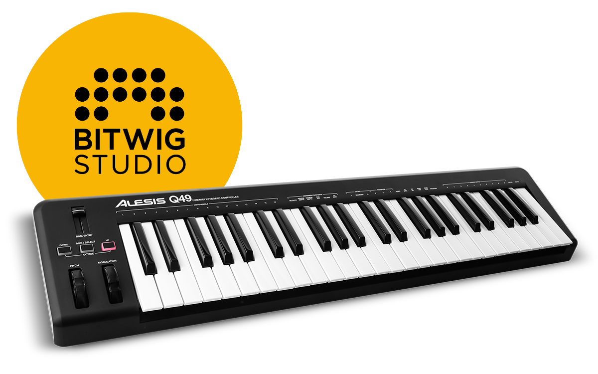

# Bitwig Controller Script for Alesis Q49
Control script for Alesis Q49 for Bitwig

## Installation and usage
Read the [official guide](https://www.bitwig.com/en/community/control_scripts/installation_guide "Control Script Installation Guide")

## Features
Automatically maps the volume of the current track and panning
